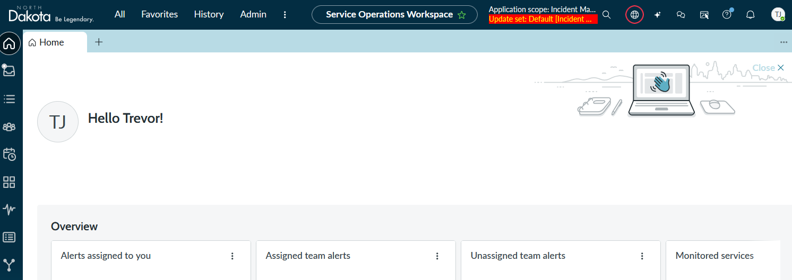
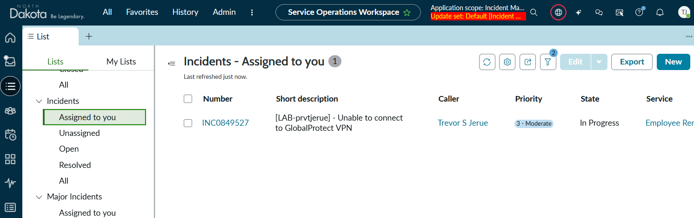

# NDIT TechDayz - Triaging VPN Outages in Service Operations Workspace

## Service Operations Workspace: guided VPN incident response

**Audience:** ServiceNow agents and platform-adjacent team members who are familiar with working records but are not expected to configure or develop a workspace or Playbook.

**Core lab time:** 35 minutes

**Optional extension:** 5–8 minutes


## What you will learn

By the end of this lab, you should be able to:

1. Find and open assigned work in Service Operations Workspace (SOW).
2. Use the information on an Incident to understand the affected service and configuration item.
3. Follow a Playbook that guides investigation and presents relevant knowledge in the flow of work.
4. Use the Playbook to act on an Outage related to the Incident without leaving the Incident record.
5. Document the result so another agent can understand what was checked and what changed.
6. Explain how a focused workspace and a Playbook can reduce navigation and make a repeatable process easier to follow.

## Before you begin

This is an agent workflow lab. You will use a Playbook, but you are not expected to build, configure, or publish one.

| Lab item | Lab value |
| --- | --- |
| Sandbox URL | `<https://northdakotasandbox.service-now.com>` |
| SOW landing page or navigation path | `</now/sow>` |
| Lab incident short description | `[LAB-username]` — Unable to connect to GlobalProtect VPN |
| Lab knowledge article | `<KB0018355 v1.0>` — recommended: VPN authentication troubleshooting checklist |
| Lab CI / service | `<Corporate VPN - Production>` / `<Employee Remote Connectivity>` |
| Lab assignment group | `<NDIT-End User Compute>` |


### Scenario

You are an End User Compute agent responding to an employee who cannot connect to the GlobalProtect VPN. The Incident has already been created for you and includes the affected CI and service. A Playbook will guide you through the troubleshooting sequence, surface the relevant knowledge article, evaluate the result, find the Incident’s associated Outage, and let you record that service has been restored.

| Record or field | Lab value |
| --- | --- |
| Incident short description | `[LAB-username]` — Unable to connect to GlobalProtect VPN |
| Assignment group | `<NDIT-End User Compute>` |
| Affected CI | `<Corporate VPN - Production>` |
| Business service | `<Employee Remote Connectivity>` |
| Knowledge | `<KB0018355 v1.0>` — VPN authentication troubleshooting checklist |
| Related Outage | One active Outage associated with the participant’s Incident |
| Outage starting condition | **Begin** is populated and **End** is empty |

## Lab conventions

- Labels, tabs, and actions may vary slightly by ServiceNow release and local configuration. Use the equivalent function if the wording differs.
- Work only on the Incident whose short description begins with your `[LAB-username]`.
- Do not change the CI, service, assignment group, Playbook configuration, or workspace configuration.
- Complete Playbook activities in order. Later activities may depend on information or decisions produced by earlier activities.
- Do not open and manually edit the Outage unless the guide explicitly asks you to verify it. The Playbook performs the update.
- If the Playbook is missing, does not advance, or displays the wrong Incident, stop and ask the facilitator for assistance instead of improvising around it.

---

## Exercise 1 — Open SOW and find your Incident (5 minutes)

### Goal

Orient yourself in SOW and locate the work created for your lab account.

1. Sign in to `<https://northdakotasandbox.service-now.com>`.

   

2. Open Service Operations Workspace by navigating to `</now/sow>`.

   

3. Take 30 seconds to identify the navigation pane, landing page, work lists or queues, and any assigned-work indicators exposed by your SOW experience.

   

4. Open the Incident list or assigned-work queue and locate the Incident with this short description:

   ```text
   [LAB-username] — Unable to connect to GlobalProtect VPN
   ```

   Replace `username` with the value associated with your lab account.

   

5. Open the Incident in a workspace tab.

   

### Checkpoint

Confirm that the short description begins with your lab username. Do not continue on another participant’s Incident.


> Reflection: What information about the Incident was visible before you opened the record?


---

## Exercise 2 — Frame the Incident and take ownership (7 minutes)

### Goal

Confirm that you have the correct record, understand the affected service, and leave an auditable starting point.

1. Confirm the Incident short description:

   ```text
   [LAB-username] — Unable to connect to GlobalProtect VPN
   ```

   

2. Confirm that the Incident is assigned to `<NDIT-End User Compute>`.

   

3. Confirm the related service and CI:

   ```text
   Service: Employee Remote Connectivity
   CI: Corporate VPN - Production
   ```

   Do not edit either value.

   

4. Review the activity stream or record history before changing the Incident.

   

5. Assign the Incident to yourself, or use the lab owner specified by the facilitator, and change the state to **In Progress** or the equivalent active state used in the sandbox.

   

6. Add the following work note:

   ```text
   Investigation started in Service Operations Workspace. Confirmed the affected service is Employee Remote Connectivity and the affected CI is Corporate VPN - Production. Beginning the guided VPN troubleshooting Playbook.
   ```

   

7. Save or update the Incident and verify that the work note appears in the activity stream.

   


### Checkpoint

Another agent should now be able to tell who owns the Incident, what is affected, and what guided process you are starting.


---

## Exercise 3 — Use the Playbook to investigate and restore service (15 minutes)

### Goal

Follow a repeatable process that brings guidance, knowledge, decisions, and related-record actions into the Incident experience.

1. Open the native **Playbook** tab or Playbook panel on the Incident record.

   

2. Confirm that the VPN troubleshooting Playbook is attached to your Incident and review its visible stages or activities before starting.

   If no Playbook appears, stop and ask the facilitator for assistance.

   

3. Begin the first available Playbook activity and follow the instructions presented in SOW.

   Complete activities in order; do not skip ahead.

   

4. Open and review `<KB0018355 v1.0>` when the Playbook presents the knowledge step.

   Use the article’s VPN authentication troubleshooting checklist to identify the recommended checks. Do not edit the knowledge article.

   

5. Complete the guided troubleshooting activity using the checklist in `<KB0018355 v1.0>`.

   For this simulation, follow the facilitator’s lab instructions rather than making changes to your own device or credentials.

   


BONUS: Try locating a knowledge article using the **Agent Assist** feature, while you have the Playbook open.  

6. When the Playbook asks whether the VPN connection is now successful, select **YES** so the lab continues through the active-Outage path.

   This response is part of the simulation. It does not indicate that the troubleshooting checklist was performed incorrectly.

   

7. Continue the Playbook and allow it to locate the Outage associated with your Incident.

   The Playbook uses the Incident-to-Outage relationship prepared for the lab. Do not search for or substitute another participant’s Outage.

   

8. Review the Outage information presented by the Playbook and confirm that it relates to your Incident and `<Corporate VPN - Production>`.

   The Outage should be active: **Begin** is populated and **End** is empty.

   

9. Complete the Playbook activity that records restoration of the VPN service.

   The Playbook updates the related Outage’s **End** value directly from the Incident experience. You are demonstrating what the platform can do; you are not defining a production authorization or governance model for who should end Outages.

   

10. Verify that the Playbook activity completes successfully and advances to its final instruction or completion state.

    If the activity fails or the Playbook does not advance, stop and show the facilitator the visible error.

    

### Checkpoint


You have used one guided experience to review knowledge, record a troubleshooting decision, find a related Outage, and update that Outage without navigating away from the Incident tab.


> Reflection: Which parts of this sequence did the Playbook make easier to remember or harder to perform out of order?

---

## Exercise 4 — Verify and document the outcome (5 minutes)

### Goal

Confirm that the related record changed and leave enough context for the next agent.

1. Use the related information available from the Incident or Playbook to verify that the associated Outage now has an **End** value.

   Do not manually change the Outage. You are verifying the Playbook’s result.

   

2. Return to the Incident record if the verification opened another workspace tab or panel.

   

3. Add the following work note:

   ```text
   Completed the guided VPN troubleshooting Playbook. Reviewed KB0018355 v1.0 and the Corporate VPN - Production CI. The Playbook located the Incident's related active Outage and recorded the service restoration time.
   ```

   

4. Save or update the Incident.

   

5. Review the activity stream and confirm that both lab work notes are visible in chronological order.

   

### Checkpoint

Can a teammate who did not attend the lab understand what you reviewed, what the Playbook did, and which related record changed?

---

## Exercise 5 — Evaluate the experience (3 minutes)

### Goal

Connect the lab steps to the design purpose of SOW and Playbooks.

1. Review the Incident, Playbook, knowledge article, service/CI context, and Outage result as one completed unit of work.

   

2. Record one place where SOW reduced navigation or kept useful context near the Incident.

   

3. Record one place where the Playbook made the process more repeatable, understandable, or auditable.

   

4. Finish this sentence:

   > The Playbook was most useful when ____________________, because ____________________.

   

### Checkpoint

Be prepared to share one specific observation during the debrief.

---

## Optional extension — Compare SOW and Core UI (5–8 minutes)

This extension is for comparison, not configuration.

### Goal

Choose the work surface that best supports the task instead of declaring one interface the winner by default.

1. Open the same incident in the Core platform (Hint: navigate back to https://northdakotasandbox.service-now.com in a new tab).

   

2. Compare the same Incident in both experiences.

   

3. Complete the table below.

   | Question | SOW observation | Core UI observation |
   | --- | --- | --- |
   | How did I find the record? |  |  |
   | What context was immediately visible? |  |  |
   | Where was the guided Playbook available? |  |  |
   | What did I need to navigate elsewhere to find? |  |  |
   | Which view better supported this exact task? |  |  |

   

4. Finish this sentence:

   > SOW is the better default for ____________________, while Core UI is still useful for ____________________.

   

## Debrief prompts (8 minutes)

Use these questions as a group:

1. Where did SOW reduce navigation or context switching?
2. What did the Playbook make easier to understand or harder to perform out of order?
3. What was useful about seeing the knowledge guidance within the guided process?
4. What did it mean for the Playbook to act on an Outage related to the Incident?
5. What access-control, approval, ownership, or governance questions would need answers before using this exact Outage update in production?
6. Which part of the experience depended on local configuration rather than SOW alone?
7. What is one small improvement that would make this guided workflow more reliable for an agent?

## Completion criteria

You are done when you have:

- Opened your participant-specific Incident in SOW.
- Confirmed `<NDIT-End User Compute>`, `<Corporate VPN - Production>`, and `<Employee Remote Connectivity>` on the Incident.
- Reviewed `<KB0018355 v1.0>` through the Playbook.
- Completed the Playbook’s VPN troubleshooting and decision path.
- Used the Playbook to record the **End** value on your Incident’s related Outage.
- Added work notes that document the investigation and result.
- Made one evidence-based observation about the value of SOW and the Playbook.


## Additional ServiceNow documentation

- [Service Operations Workspace for ITSM — ServiceNow Docs](https://www.servicenow.com/docs/r/it-service-management/service-operations-workspace/sow-landing-page.html)
- [Playbook Experience overview — ServiceNow Docs](https://www.servicenow.com/docs/r/build-workflows/workflow-studio/playbook-ui.html)
- [Customize the Playbook Experience — ServiceNow Docs](https://www.servicenow.com/docs/r/build-workflows/workflow-studio/playbook-customize-playbook.html)
- [Use Agent Assist in Service Operations Workspace — ServiceNow Docs](https://www.servicenow.com/docs/r/it-service-management/service-operations-workspace/agent-assist-ur-sow.html)
- [Forms in the classic environment — ServiceNow Docs](https://www.servicenow.com/docs/r/platform-user-interface/c_UsingForms.html)
